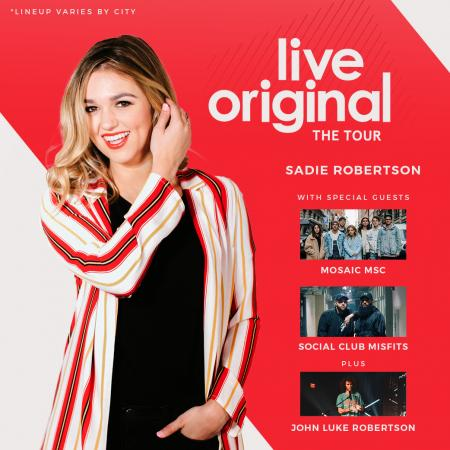

# This Week @ FPS  
Here's what's going on at fpStudents this week, as well as some future events to plan for. Thanks for all that you do to make this ministry a success!  

## 12 Sept 2018 | Throwback Night  
Dress up & represent some time from the past that you feel connected to. Doesn't matter if you are a 60's hippie, still have the big hair from the 80's, or you just like dressing up in your own vintage flair.

### Survey Night  
Please pick up a survey card at check-in and turn in at the information tables after small group.  

### Group Guides  
- [*Sway* Week 1 - You Have All You Need](guide.pdf) *(7th - 12th grade)*  
- [*Wired* Week 2 - Made in God's Image](guide-6th.pdf) *(6th grade only)*  

### Reserve Your *Live Original Tour* Tickets  
Don't forget to reserve your free tickets for [Sadie Robertson's Live Original Tour](https://liveoriginal.com/) at FPS this week - **supplies are extremely limited and close to "selling" out!** You must reserve a seat in order to attend fpStudents on 24 Oct 2018.

### New Pages for Leaders and Coaches  
Take a minute or two to check out the new pages dedicated to our awesome [leaders](leaders.md) and [coaches](coaches.md). We will be posting more online training resources here soon, but reviewing what's already there is a great start towards improving your effectiveness in your current role.  

## 19 Sept 2018 | Rockstar vs Rapper  

## 26 Sept 2018 | Island Night  

## 3 Oct 2018 | Blackout  

## 10 Oct 2018 | PJ Night  

## 17 Oct 2018 | Color Wars  

### *Live Original Tour* Reserved Ticket Pickup  
You must pick up your reserved ticket this week in order to attend the event next week.

## 24 Oct 2018 | Live Original Tour  
FPS will be hosting [Sadie Robertson's Live Original Tour](https://liveoriginal.com/) with special guests [Mosaic MSC](https://www.mosaicmsc.com/), [Social Club Misfits](http://www.socialclubmisfits.com/), and [John Luke Robertson](http://duckcommander.com/meet-the-family/john-luke-robertson).  
  

## 31 Oct 2018 | Costume Night  

# 18-20 Jan 2019 | Fusion Weekend   
*Fusion is an overnight weekend retreat that begins on Friday evening and ends on Sunday afternoon. Leaders and students will stay in a local host home for fellowship, small group time, meals, and some sleep each night. Music, worship, speaker messages, and just-for-fun events are experienced Friday night and throughout the day Saturday. The weekend closes out on Sunday at your local Faith Promise campus.*  

## Leader Registration  
[Fusion Leader Registration](https://my.faithpromise.org/portal/get_form.aspx?id=bad6d912-5be3-4035-8018-f97b6930be56) is open now - please register as soon as you are able!

## Host Homes
Fusion is earlier in the year that in the past, so it's super important that leaders secure host homes as early as possible. Start asking the parents of your students NOW - **our goal this year is for every small group to have a host home by Thanksgiving!**  

# 17-21 July 2019 | Movement Conference  
*Movement is a three day conference where students from across the state of Tennessee are encouraged and inspired to join the movement and take it back to their schools and communities. Students will experience incredible worship and music, be inspired by world-class communicators, and have a ton of fun with hundreds of other students. An awakening is coming to our nation, and we believe it will start right here, right now - will you join the Movement?*  

## Student & Leader Registration
[Registration is now open for Movement Conference 2019](https://movementconf.com/) for everyone; leaders can register for free using the promo code `OWNER19`.

<!--End of Markdown Content-->

<!--Bottom Page Nav Buttons-->

<a class="btn btn-default btn-sm" href="/leaders" role="button"><b>Leaders</b>&nbsp;<i class="fa fa-arrow-right"></i></a>
